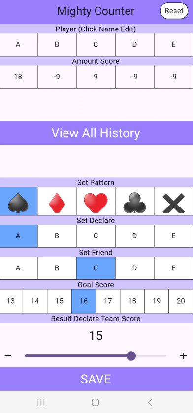
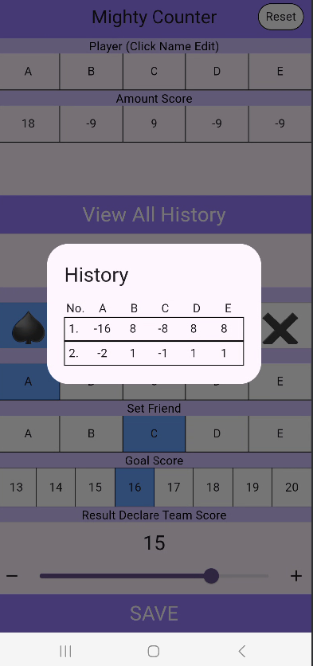

# Mighy Counter - 마이티 카운터

## :loudspeaker: Description
마이티(보드게임)의 오프라인 플레이 시 번거롭던 점수 계산을 앱으로 할 수 있게 도와줍니다.
현재 PlayStore 검토 중이며 웹 도메인 또한 배포 예정입니다.

## :mega: 주요 기능
  - 마이티 점수 계산
    - History 확인 가능
    - 플레이어 이름 변경 가능
    - 수익을 위한 광고 기능

## :mag_right: OverView

## 스크린 샷
  
### 1. 계산기 화면

### 2. 히스토리 Dialog

 ## :iphone: Flutter 사용 기술

| Name             | Description                           |
| ---------------- | ------------------------------------- |
| Architecture     | MVVM                                  |
| UI               | Provider, freezed                     |
| DI               | Provider                              |

 
